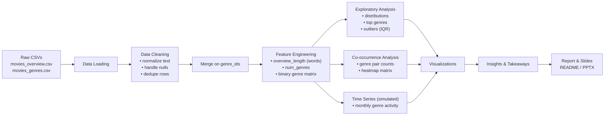

# Movie Genre & Overview – Exploratory Data Analysis (EDA)

## Overview
This project performs an **Exploratory Data Analysis (EDA)** on a movie dataset containing **overview text** and **associated genre labels**. The primary objectives are to:
- Identify trends in genre co-occurrence.
- Analyze textual patterns in movie overviews.
- Explore engineered features for potential downstream applications such as **content recommendation** or **genre prediction**.

---

## Dataset
The analysis is based on two CSV files provided in a compressed archive:

| File | Description |
|------|-------------|
| `movies_overview.csv` | Contains movie titles, overview text, and genre IDs. |
| `movies_genres.csv`   | Maps genre IDs to their respective genre names. |

**Data Preparation:**
- Merged datasets on `genre_ids`.
- Created new features:
  - `overview_length` – word count of each movie's overview.
  - `num_genres` – number of genres assigned to a movie.

---

## Project Pipeline

---

## Project Highlights
- Cleaned and merged genre and overview datasets using `genre_ids`.
- Engineered text length and genre count features.
- Visualized:
  - Top genres frequency
  - Overview length distribution
  - Genre count per movie
  - Genre co-occurrence matrix
  - Simulated churn-like genre activity over time
  - Outlier detection using IQR method
- Identified common genre combinations and textual patterns.

---

## Visualizations

| Visualization | Purpose |
|---------------|---------|
| **Bar Plot**  | Top 10 most common genres. |
| **Histogram** | Overview length distribution. |
| **Count Plot**| Number of genres per movie. |
| **Heatmap**   | Genre co-occurrence matrix. |
| **Line Chart**| Simulated churn trend over time. |
| **Boxplots**  | Outlier detection for genres and text length. |

---

## Key Insights
- **Top Genres:** Drama, Comedy, and Action dominate the dataset.
- **Overview Length:** Most overviews contain 50–150 words.
- **Genre Count:** Majority of movies have 2–3 genres; few have 5+.
- **Common Pairs:** Drama + Romance, and Action + Adventure frequently co-occur.
- **Text vs. Genres:** Weak correlation between overview length and number of genres.

---

## Files in Repository
| File | Description |
|------|-------------|
| `Midterm.ipynb` | Jupyter Notebook with full EDA workflow and visualizations. |
| `Movie_Genre_Overview_EDA_Presentation.pptx` | Presentation deck summarizing findings and insights. |

---

## Tools & Libraries
- **Language:** Python 3.x
- **Libraries:** Pandas, NumPy, Seaborn, Matplotlib, Scikit-learn
- **Environment:** Google Colab / Jupyter Notebook

---

## Future Work
- Apply NLP models (e.g., BERT) to predict genres from overview text.
- Add and analyze release year data to explore genre evolution over time.
- Perform clustering on overview embeddings to detect latent thematic structures.

---

## License
This project is open-source under the [MIT License](LICENSE).

---

## Acknowledgments
- Dataset inspired by CS 661 coursework.
- Project developed using guidelines from NVIDIA's EDA presentation framework.
- Thanks to the maintainers of open-source libraries used in this analysis.

---
